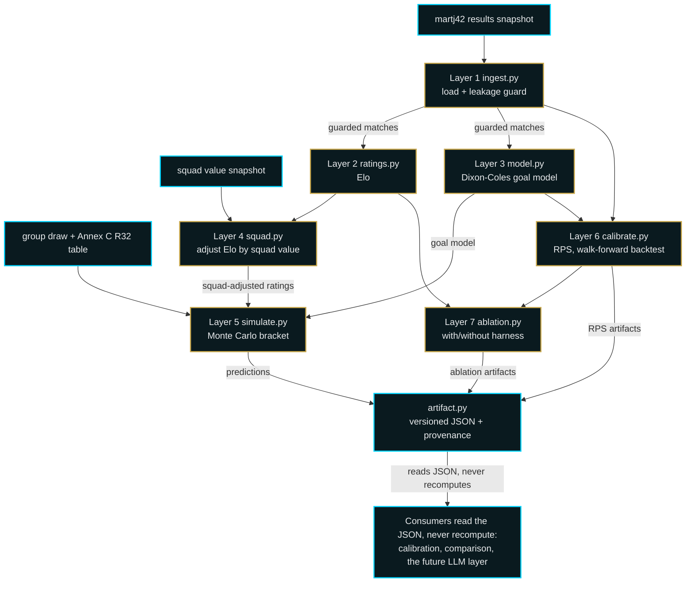
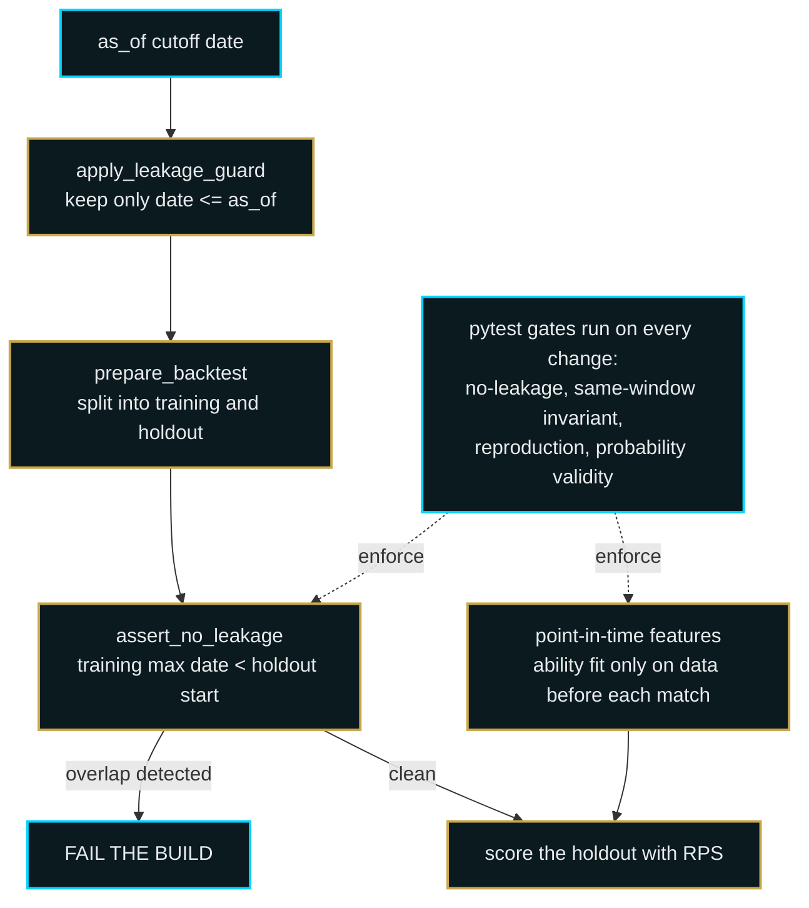
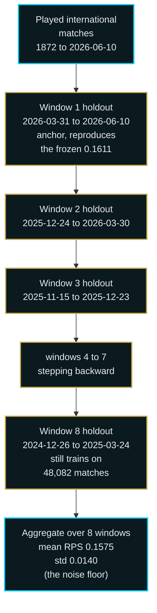
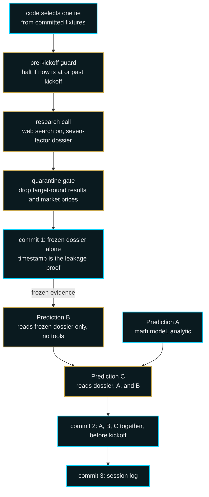
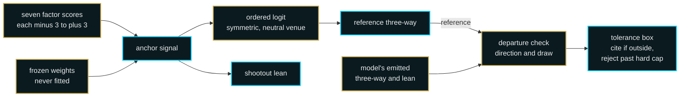
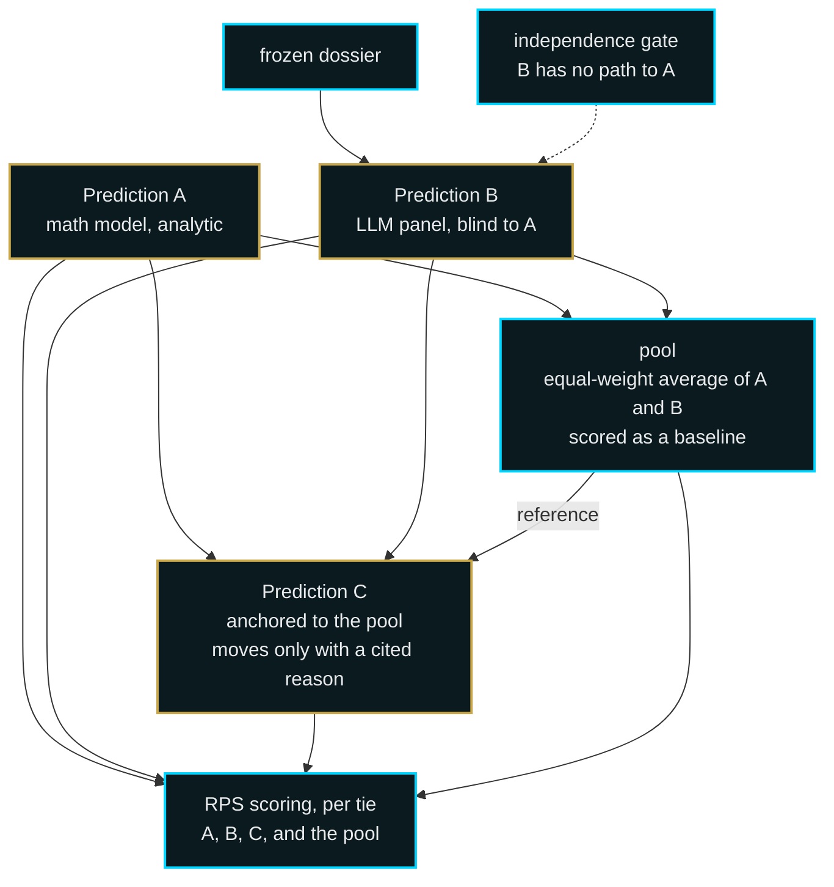

# Architect WorldCup

A live World Cup 2026 bracket re-simulator built verification-first. The point of
this project is not the forecast. The point is that you can trust it. Every number
it produces is defended by a real test, leakage is a build failure rather than a
footnote, and the experiments that did not work are kept in the record next to the
ones that did.

Out of sample, across eight non-overlapping backtest windows, the goal model
scores a mean Ranked Probability Score of **0.1575** with a standard deviation of
**0.0140**, against a base-rate baseline of **0.2292** on the same windows. Lower
is better. That spread, not any single lucky window, is the headline. A single
frozen calibration window, used throughout as the reproduction anchor, sits at
**0.1611** against a **0.2135** baseline.

---

## 1. Summary

Architect WorldCup ingests the full history of international football, rates every
national team, fits a Dixon-Coles goal model, adjusts for current squad value,
and runs a Monte Carlo simulation of the real 2026 tournament with the actual FIFA
group and bracket rules. It produces, for every team, the probability of reaching
each knockout round and of winning the tournament.

It is a command-line system. It runs on a manual trigger, writes versioned JSON
artifacts with full provenance, and is reproducible to the digit from a fixed seed
and immutable dated data snapshots. There is no web app and no scheduler. The
architecture and the honesty are the product.

---

## 2. Thesis: independence and verifiability over raw accuracy

The goal was never to beat the betting market. The market, with its liquidity and
its army of professional modelers, is extremely hard to beat, and a system whose
only claim is "slightly more accurate than a bookmaker" is both unlikely to be
true and impossible to verify from the outside.

This project makes a different claim: that the forecast is **independent** and
**verifiable**.

Independent, because it deliberately uses no bookmaker odds. A model that ingests
market prices is, in large part, copying the market. By refusing odds as an input,
this system can later be benchmarked against the market as a genuinely separate
opinion rather than a derivative of it.

Verifiable, because every claim is backed by a test that runs in the normal suite.
The leakage guard is not a comment promising good behavior, it is an assertion
that fails the build. The headline accuracy number is not a single run, it is a
rolling-origin backtest with a measured spread. The features are constructed
point-in-time, and a test proves that a feature for a match cannot see that match
or anything later. When an idea was tried and did not help, the measurement that
rejected it is committed alongside the code.

Accuracy matters, but it is downstream of trust. A number you cannot verify is
worth nothing, however good it looks.

---

## 3. Architecture

The system is a seven-layer pipeline. Each layer is a module with a single
responsibility, and the layers communicate through plain data, not through shared
mutable state. The model layers emit a versioned JSON artifact, and every
downstream consumer reads that JSON rather than recomputing anything. This
separation of model from presentation is the spine of the design.

| Layer | Module | Responsibility |
| --- | --- | --- |
| 1 | `ingest.py` | Load match data into immutable dated snapshots, enforce the leakage guard |
| 2 | `ratings.py` | Transparent hand-written Elo ratings |
| 3 | `model.py` | Dixon-Coles goal model via penaltyblog |
| 4 | `squad.py` | Bounded squad-value adjustment to the ratings |
| 5 | `simulate.py` | Monte Carlo simulation of the real 2026 tournament |
| 6 | `calibrate.py` | RPS scoring, single-window and walk-forward backtests |
| 7 | `ablation.py` | With-and-without harness to measure each layer |

Two further modules support the layers without being layers themselves:
`artifact.py` owns the versioned JSON output and provenance log, and `pipeline.py`
is the single entry point that wires the layers together. Two more modules exist
to interrogate the system: `audit.py` runs the data-integrity and overconfidence
checks, and `ensemble.py` holds a gradient-boosting experiment that is documented
below precisely because it did not win.

### How the layers actually call each other



The forecast path runs left to right: guarded matches feed both the rating layers
and the goal model, squad value nudges the ratings, and the simulator consumes the
adjusted ratings and the goal model to produce predictions, which become the JSON
artifact. Calibration and ablation form a separate evaluation track that reuses
the same rating and goal-model code rather than forking it, and they emit their own
versioned artifacts.

### How the goal model and the simulator communicate

The goal model and the simulator are deliberately separate. Dixon-Coles owns the
scoreline distribution. The simulator owns the tournament logic and never second
guesses the goal model. They meet at a single seam: a sampler that draws a
scoreline from the Dixon-Coles joint goal matrix.


The simulator encodes the genuine 2026 format: 12 groups of four, the real group
draw, the FIFA within-group tiebreaker ladder where head-to-head results are
applied before overall goal difference, a separate ranking of the third-placed
teams to fill the round of 32, and the official 495-row Annex C table that maps
each combination of qualifying third-placed teams to specific bracket slots,
parsed from the published schedule and committed as a controlled input.

---

## 4. Verification and anti-leakage

This is the heart of the project. A forecasting system is only as trustworthy as
its weakest path to seeing the future, so leakage is treated as the primary risk
and is engineered against at every layer.



**Leakage as a hard failure.** Every backtest window is built by a single shared
function that splits the data at a cutoff and then asserts that the latest training
match falls strictly before the first holdout match. If that assertion ever fails,
the run raises and the test suite goes red. It is not possible to score a window
whose training data overlaps its holdout.

**The same-window invariant.** A reviewer pointed out that a low score is exactly
when a careful engineer audits for hidden leakage rather than celebrating. That
audit became a permanent gate. The data carried two benign duplicate fixtures, and
rather than gate the proxy of "no duplicate rows," the suite gates the real
concern: no match, identified by date and the two teams, may appear in both the
training set and the holdout set of the same window. Because a duplicate shares an
exact date and the split is purely by date, both copies always land on the same
side, which the gate verifies across every window.

**Point-in-time feature construction.** The hardest leakage risk in the whole
project was the gradient-boosting experiment described in section 6, whose strongest
feature is a Dixon-Coles ability estimate. The naive way to build that feature, a
single model fit over the whole window read back onto every training row, lets each
row see a strength partly shaped by its own result. Instead the ability is built
from a grid of refits, where each refit uses only data strictly before its grid
date, and a match takes the abilities from the latest grid date at or before it. A
test proves the guarantee directly: tamper with a match's own result and every
later result, and the feature for that match does not change.

These checks live in the normal `pytest` suite, alongside schema validation,
ratings sanity, goal-model correctness, simulator tiebreaker logic, determinism,
and probability validity. The suite is the contract.

---

## 5. Results, honestly framed

The model is evaluated with the Ranked Probability Score, the appropriate metric
for ordered three-outcome football predictions, on a rolling-origin walk-forward
backtest. The most recent window is anchored exactly on the frozen single-window
calibration, which it reproduces to the digit, and seven further non-overlapping
windows of 150 matches each walk backward through time. Non-overlap is deliberate:
overlapping windows share matches and would fake a tighter spread than the data
supports.



Each window trains on everything strictly before its own holdout, scores its 150
held-out matches, and recomputes its own base-rate baseline from its own training
data. The next window's cutoff is the previous window's training maximum, so the
holdouts are contiguous and share no matches. Even the oldest window trains on more
than 48,000 matches, so every window has a deep history behind it.

**The result.** Mean RPS **0.1575**, standard deviation **0.0140**, minimum 0.1336,
maximum 0.1764, against a base-rate baseline that averages **0.2292** over the same
windows. The model beat its own baseline in every one of the eight windows. The
single-window anchor, kept frozen and never overwritten, reads **0.1611** against a
**0.2135** baseline.

That standard deviation of 0.0140 is treated as the noise floor for the whole
project. No later change counts as a real improvement unless it moves the aggregate
mean by more than this spread. It is the bar every experiment in the next section
had to clear.

**A caveat against overclaiming.** International football is an easier distribution
to predict than club football. National teams play less often, the talent gap
between the strongest and weakest sides is wider than in a top domestic league, and
results are correspondingly more predictable. An RPS in this range is good, but it
is good on a friendly distribution, and it should not be read as a club-level
result. The honest framing is that the system is well calibrated for what it
models, not that it has solved football.

---

## 6. What did not work

These are kept in the record as a matter of rigor, not apology. A verification-first
project that only reported its successes would be contradicting its own thesis. Two
ideas were built properly, measured against the 0.0140 noise floor, and rejected.

**Friendly-match downweighting.** Friendlies are about 37 percent of the training
data and are low-stakes, often played with experimental lineups, so the hypothesis
was that downweighting them would sharpen the fit. It was implemented as a tunable
weight that multiplies onto the existing time decay, defaulted off so the headline
numbers could not move silently, and measured. On the single calibration window it
moved the score from 0.1611 to 0.1617, a change of plus 0.0006, well inside the
0.0140 noise floor and in the wrong direction. It did not help. The default stays
off, and both numbers live in the record.

**The hybrid ensemble.** This was the academically strongest idea in the project: a
gradient-boosting model in the Groll and Zeileis style, taking ability estimates
plus covariates as features, the kind of approach that wins forecasting papers. It
was built in full, with four leakage-safe point-in-time features, the
squad-adjusted Elo difference, the Dixon-Coles ability difference, squad value, and
rest-days, and evaluated on the exact same eight walk-forward windows as the goal
model.

It did not beat Dixon-Coles. The ensemble scored a mean of **0.1618** against the
goal model's **0.1575**, a difference of plus 0.0044, comfortably inside the 0.0140
noise floor and slightly worse on the point estimate. The permutation feature
importances explain why:

| Feature | Importance |
| --- | --- |
| Elo difference | +0.2182 |
| Dixon-Coles ability difference | +0.1452 |
| Squad value | +0.0025 |
| Rest-days | -0.0038 |

Almost all of the signal is in the two strength features, which encode the same
information the goal model already uses. Squad value and rest-days are close to
noise. A more sophisticated technique built from the same strength signal lands on
top of the simple model, not beyond it. The lesson is the standard one in applied
machine learning and worth restating: features drive accuracy, not technique. The
ensemble and its measurement stay in the repository as a documented, gated
experiment.

---

## 7. Live forecast

> **Status: pending.** The definitive live forecast will be the post-group-stage
> run, once all 72 group matches are complete. The mid-tournament numbers below
> exist and are reproducible, but they are not the final word and are not presented
> as such. This section is structured to receive the definitive run.

The live pipeline is built and works. It takes a clean cutoff, anchors on the real
results played so far by fixing those group fixtures and simulating only the
remainder, and writes a separate dated artifact so each forecast is a frozen
record. A leakage proof is enforced at the live cutoff exactly as in the backtest:
the latest training match must fall strictly before the cutoff boundary.

A mid-group-stage run at a cutoff of 2026-06-22, with 44 real group results
anchored, is on disk and can be referenced. It is provisional. The post-group-stage
forecast will replace this paragraph with the definitive numbers.

There are three frozen forecast artifacts worth distinguishing precisely, since the
structure of the simulator changed during development:

1. The original forecast on a **placeholder group structure**, from before the real
   2026 draw was installed. Superseded, kept only as history.
2. The **pre-tournament forecast on the real structure**, at a cutoff of
   2026-06-10 with no tournament results yet. This is the honest pre-tournament
   baseline going forward.
3. The **live forecast on the real structure**, at a cutoff of 2026-06-22, anchored
   on the real results so far. Provisional, to be superseded by the post-group-stage
   run.

When the numbers are compared, the meaningful comparison is between the second and
the third, since both use the real structure and the only difference between them
is the ingested results. Comparing against the first would conflate the structure
change with the effect of real data and would be misleading.

---

## 8. Math versus LLM comparison

> **Status: method built and committed, results forthcoming.** The full prediction
> machine described here is implemented, tested, and committed. No tie has been
> predicted yet. Predictions are committed before each knockout round is played and
> scored after, round by round, so the results fill in over the tournament. The first
> predictions, for the round of 32, are imminent.

The capstone of the project is a head-to-head between the mathematical model and a
large language model, scored with the same Ranked Probability Score, forward-only,
one knockout tie at a time. Each tie produces three predictions, and all three are
scored honestly against what actually happens.

**The three predictions.** Prediction A is the mathematical model from the previous
sections applied to a single tie: the exact 90-minute three-way from the Dixon-Coles
grid at a neutral venue, with the shootout resolved by the same strength-weighted
coin flip the simulator already uses. It is analytic and reproduces to the digit.
Prediction B is an independent language-model forecast for the same tie, blind to A.
Prediction C is a reconciliation pass that reads both A and B and their reasoning and
issues a final call. A is the established model, B is a different kind of intelligence
asked the same question, and C is the synthesis.

**Two phases, with a frozen dossier between them.** The language-model path is split
into a research phase and a prediction phase that never run together. Research runs
first with web search on and builds a seven-factor dossier on both teams. That
dossier is committed on its own, before any prediction is made from it, and its commit
timestamp is the leakage proof: a search run before kickoff cannot return a result
from after kickoff. The prediction phase then reads only the frozen dossier, with no
tools and no web access. Each tie is selected by code from the committed fixtures, not
chosen by the model, and no round is predicted before its field is fixed.



**From factors to a probability.** Prediction B does not emit a probability out of
thin air. Seven analyst lenses score seven factors from the dossier, each on a scale
from minus three to plus three, from the nominal home team's perspective. Frozen
weights, pre-registered and never fitted on outcomes, combine those scores into a
single anchor signal.

| Factor | Weight |
| --- | --- |
| Squad availability and starting lineup | 0.22 |
| Recent form and underlying performance | 0.20 |
| Tactical and stylistic matchup | 0.18 |
| Coaching and staff | 0.15 |
| Strategic incentives | 0.12 |
| Psychological and momentum | 0.07 |
| Historical head-to-head | 0.06 |

A symmetric ordered-logit mapping turns that signal into the 90-minute three-way,
with the draw highest when the teams are even and falling as the gap widens, and a
compressed sigmoid turns it into the shootout lean. The mapping is fixed by three
constants, also priors: a draw band that puts even teams near a thirty percent draw,
a slope that caps the strongest favorite near eighty percent in ninety minutes, and a
shootout compression that pulls even the strongest favorite back toward an even split
once a match is level. The model then emits its own three-way, and code measures how
far that sits from the mapping's reference on two axes, direction and draw. Small
departures are allowed and must be justified in writing; departures past a hard cap
are rejected and regenerated. The mapping parameters are set from general football
priors, never from Prediction A, so the two forecasts stay genuinely separate.



**Independence, and what each layer sees.** The comparison is only meaningful if B
cannot see A, so B has no read path and no import path to A, enforced by a test. C is
different by design: it sees the dossier, A's forecast and the strength differentials
that produced it, and B's forecast and its per-factor reasoning. C is anchored to the
equal-weight average of A and B, the pool, and may move off it only with a cited
reason. The pool is also scored in its own right, as a baseline, because a
reconciliation that merely averages its inputs should not be mistaken for one that
adds judgment. C against the pool is the comparison that isolates whether the language
model's reasoning earned its place.



**Leakage control specific to the language model.** Forward-only timing is the hard
guarantee, but it is not the only control. A quarantine gate, the analog of the
build-failing leakage guard in section 4, runs over every researched finding: it drops
any result or advancement at the target round or later, preserves legitimate pre-cutoff
form, and strips every market price so the forecast stays independent of the betting
market exactly as the math model does. The gate prefers false positives, so it will
occasionally drop a legitimate forward-stakes fact rather than risk leaking one, and
when it does, the coverage manifest records it rather than hiding it.

**Nothing is asserted without a citation.** Every nonzero factor score must cite a
specific dossier finding, and a factor with no admissible evidence is scored zero and
flagged rather than guessed. Every material move C makes off the pool must cite one of
exactly three sources: an element of A's reasoning, an element of B's reasoning, or a
dossier finding. Neither model may introduce a fact that is not in the frozen evidence.
This is the same discipline as the rest of the project, that a number is only as good
as the test or the source behind it, applied to a language model.

**Determinism, stated honestly.** Prediction A is analytic and bit-reproducible.
Prediction B and Prediction C are not: each model is called once, with no averaging to
manufacture stability, and identical inputs can yield slightly different outputs.
Reproducibility here means provenance, not regeneration. Every call records the frozen
dossier hash it read, its full structured output, the model and settings, the token
usage, the git commit, and the timestamp. You cannot rerun B to the digit, but you can
prove exactly what it produced, from what evidence, and when.

**A caveat against overclaiming.** With roughly thirty-two knockout ties, the gap
between A, B, and C will most likely sit inside the project's own noise floor. This
section is not built to crown a winner, and a small knockout sample rewards
overconfident one-scenario bets in a way that would make any victory claim fragile.
The defensible contribution is the protocol and the transparency: a forward-only,
commit-before-kickoff comparison of three honest forecasts, scored with the same metric
as everything else, with calibration and leakage discipline treated as the result
rather than the win-loss record.

> **Live results, committed round by round.** As each knockout round's field is fixed,
> its ties are predicted and committed before the round is played, and scored after the
> matches happen. The commit history is the proof of timing: the dossier for each tie
> is committed before that tie's kickoff, the predictions before kickoff, and the
> scores afterward. The round of 32 is first, then the round of 16 once it is set, and
> so on to the final. Results and scores will appear here as they become real.

---

## 9. Limitations

Stated plainly, because a verification-first project should be the first to name its
own weaknesses.

- **Squad values are approximate.** They come from a single committed, dated
  snapshot of national-team market values, gathered as reasonable present-day
  estimates rather than official figures. They are a controlled, versioned input
  that can be refined without touching model code, but they are not exact, and as a
  feature they proved close to noise in any case.
- **International data is an easier distribution than club football.** The accuracy
  numbers are good for what they model and should not be read as club-level
  performance, as noted in the results section.
- **The model captures current strength, not tournament-specific dynamics.** It is
  trained on all international football, of which actual World Cup finals matches are
  only about 2 percent. It knows how good teams are; it does not specifically model
  the psychology and tactics of a finals knockout.
- **No bookmaker odds, by deliberate choice.** This is a limitation on raw accuracy
  and a feature of the thesis. The system trades some achievable accuracy for
  independence, so that it can be benchmarked against the market rather than
  derived from it.
- **The fair-play tiebreaker falls back.** The model cannot predict cards, so when a
  simulated tie reaches the fair-play step it falls back to a FIFA-ranking proxy and
  then to a random draw. This step is engaged often, in roughly 59 percent of live
  simulations, almost entirely at the margin where the eight best third-placed teams
  are separated and twelve teams cluster on points and goals. It rarely changes the
  title picture, since it resolves by relative strength, but it is engaged
  frequently and is reported honestly rather than hidden.

---

## 10. Reproducibility

The system is reproducible to the digit. The same seed and the same immutable data
snapshot produce the same output, and every run writes a provenance log recording
the configuration, the cutoff date, the seed, the git commit, and the UTC time.

**Run it.**

```
uv sync
uv run wc-predict          # pre-tournament forecast at the config cutoff
uv run wc-calibrate        # single-window RPS backtest, the 0.1611 anchor
uv run wc-walk-backtest    # the 8-window walk-forward, the headline 0.1575
uv run wc-ablate           # the with-and-without ablation harness
uv run wc-ensemble         # the rejected gradient-boosting experiment
uv run wc-audit            # data-integrity and overconfidence checks
uv run wc-forecast-live    # the live dated forecast, anchored on real results
```

**The gates.** The verification claims are not prose, they are tests. The suite
spans schema validation, the no-leakage guard, ratings sanity, goal-model
correctness, the squad adjustment, the simulator tiebreaker and bracket logic, the
calibration scorer, the ablation reproduction, the walk-forward invariants, the
data audit, and the ensemble leakage safety.

```
uv run ruff check .
uv run pytest -q
```

**The artifacts.** Every model and evaluation run writes a versioned JSON artifact
with provenance to `outputs/`. Presentation reads those artifacts and never
recomputes. Raw data snapshots and run outputs are immutable and are not committed
to version control; the directories are kept, the contents are local.

**License.** Proprietary, all rights reserved. This repository is public for
evaluation and reference only and is not licensed for reuse. See `LICENSE`.

---

Built by The Architect AI.
